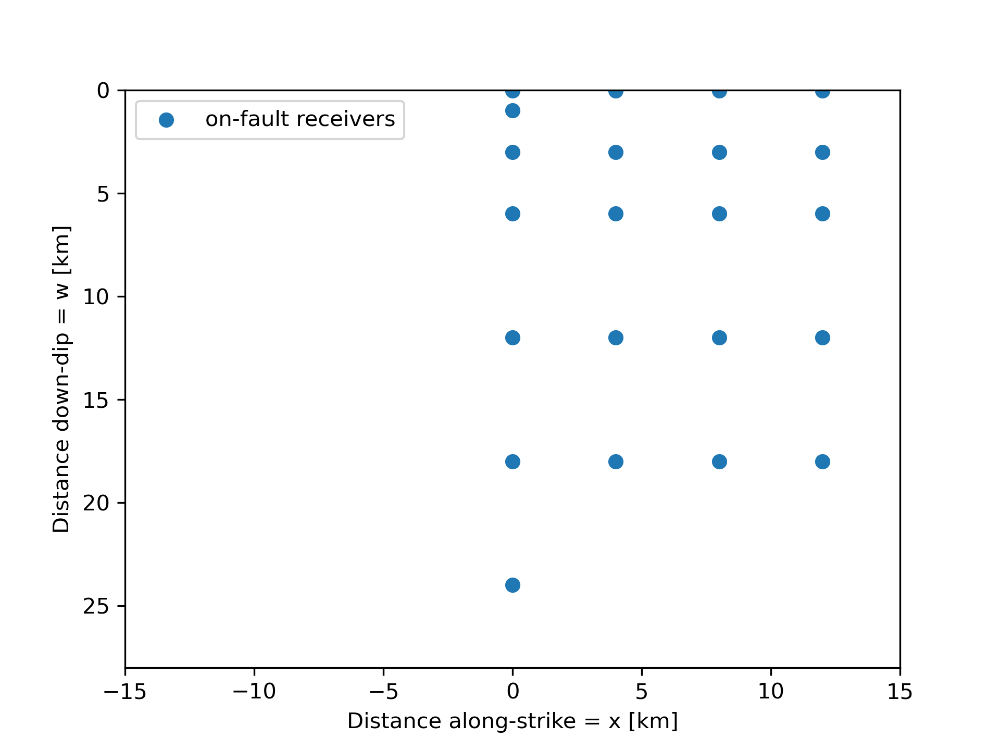
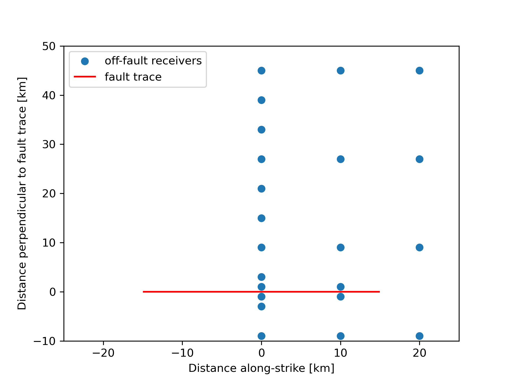

# SCEC/USGS Dynamic Rupture Benchmarks TPV36 and TPV37: Shallow Dip Thrust Fault
in collaboration with CRESCENT

For the problem description, please refer to:
- [The SCEC/USGS Spontaneous Rupture Code Verification Project](https://strike.scec.org/cvws)

Note: the only difference between TPV36 and TPV37 is the cohesion near the surface, resulting in surface rupture or buried rupture, respectively.

## Meshing

- Please see [tpv36_37_mesh_refined.geo](tpv36_37_mesh_refined.geo) for the mesh generation involving gmsh (4.12.2) and pumgen.
- A small test mesh can be found [here](https://drive.google.com/drive/folders/1wzGEdA5x_aVK-sl7zvIe9bKef-x07UMq?usp=sharing).
- A suite of larger meshes can be found [here](https://drive.google.com/drive/folders/183di9hv7lpKdfKCsd15cl6WTj0-dwZSr?usp=sharing) or by contacting The SeisSol Team.

## On-Fault Stations

## Off-Fault Stations

